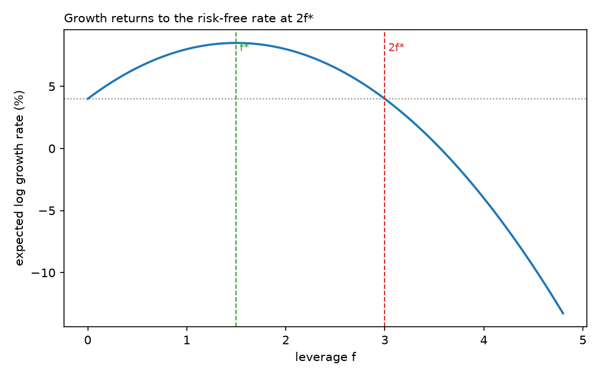
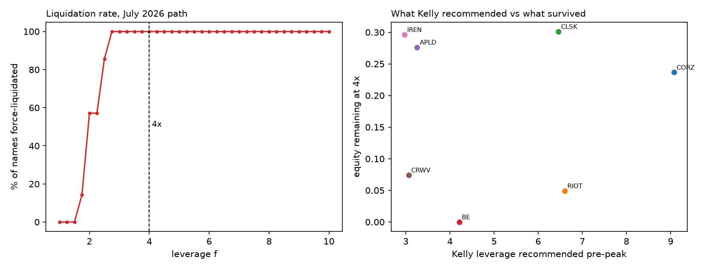
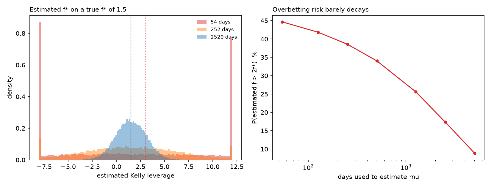

# Jump Risk in the July 2026 AI Infrastructure Drawdown

Was the July 2026 selloff in AI infrastructure equities driven by discrete
price jumps, or by sustained continuous volatility?

**Finding: it was diffusive.** The stocks that fell hardest showed roughly 11x
the realised variance of unaffected large caps, but no more jump days.

## Method

5-minute bars for 12 tickers (April-August 2026, Polygon), regular trading hours
only. For each stock-day: realised variance, bipower variation, and the
Barndorff-Nielsen and Shephard log-ratio jump test.

Groups: treated = names held by the liquidated fund; control = non-AI large caps.

## The test is oversized, and I corrected for it

Applied naively the test flagged 10-18% of stock-days as jumps at a nominal 1%
level. I calibrated it by simulating 20,000 pure-diffusion paths with no jumps.

| bars/day | nominal | actual | correct 1% critical value |
|---|---|---|---|
| 78 (5min)  | 1.0% | 2.5% | 2.84 |
| 39 (10min) | 1.0% | 3.5% | 3.04 |
| 26 (15min) | 1.0% | 3.9% | 3.28 |
| 13 (30min) | 1.0% | 5.9% | 3.82 |

All results below use the simulated critical values.

## Results

| group | 5min | 10min | 15min | 30min |
|---|---|---|---|---|
| treated | 3.4% | 6.7% | 8.4% | 6.2% |
| control | 7.5% | 11.6% | 10.1% | 5.2% |

## Limitations

- 5-minute bars are not tick data; RV is estimated with noise.
- One event. Nothing here supports inference about jump risk in general.
- Polygon free-tier data, unaudited.
- Jump rate is a ratio: high-variance names mechanically need larger moves to
  register as jumps. This design cannot separate that from a genuine difference.
- 13F holdings are lagged and incomplete, so treatment is measured with error.

## Estimators

For M intraday returns r_1 ... r_M on a given day:

Realised variance (captures all variation, jumps included):

    RV = sum of r_i^2

Bipower variation (multiplies adjacent absolute returns, so a jump — which
contaminates only one return — is largely excluded):

    BV = (pi/2) * sum of |r_i| * |r_i+1|

Under a continuous price process both estimate integrated variance and their
ratio tends to 1. A jump inflates RV but leaves BV roughly unchanged, so the
gap between them identifies the jump contribution. The test statistic is

    z = [log(RV) - log(BV)] / sqrt(theta * TP / (M * BV^2))

where theta = pi^2/4 + pi - 5 and TP is tripower quarticity, itself
jump-robust. `tests/test_estimators.py` verifies each of these properties on
simulated data.

---

# Part II: Leverage and Ruin

If the drawdown was diffusive rather than jump-driven, how much leverage could
you actually have carried through it? This section prices that question against
the same data.

## The Kelly criterion

Wealth compounds, so what matters is the growth rate of log wealth, not expected
wealth. At leverage f in an asset with drift mu and volatility sigma, financing
at r:

    g(f) = r + f(mu - r) - 0.5 * f^2 * sigma^2

Your edge grows linearly in f; the volatility drag grows quadratically. Setting
g'(f) = 0 gives

    f* = (mu - r) / sigma^2

which is Sharpe divided by volatility. Position size is a function of vol, not
of conviction. Doubling volatility quarters the optimal position.

g(f) is an inverted parabola through the risk-free rate. It returns to that rate
at exactly 2f*, so betting twice the optimal amount surrenders the entire excess
growth while carrying triple the volatility. Beyond 2f* growth is negative and a
strategy with positive expected return every period converges to zero.

## What Kelly recommended at the June peak

Estimating mu and sigma from daily closes up to 22 June only, which is the
information a fund actually had:

| ticker | mu | sigma | f* |
|---|---|---|---|
| CORZ | 320.0% | 59.0% | 9.08 |
| RIOT | 409.2% | 78.4% | 6.60 |
| CLSK | 349.7% | 73.2% | 6.46 |
| BE | 479.9% | 106.3% | 4.21 |
| APLD | 353.2% | 103.6% | 3.26 |
| CRWV | 225.1% | 85.0% | 3.06 |
| IREN | 317.2% | 102.7% | 2.97 |
| MSFT | 19.8% | 35.2% | 1.27 |

Fitted on 54 trading days of a bull run, the formula recommends 9x leverage on
Core Scientific. MSFT, a normal stock, gets 1.27x.

Note that CORZ has the lowest volatility of the treated names and therefore the
highest recommended leverage, since f* divides by sigma squared. Volatility
measured in a calm regime says nothing about the regime you are entering.

## Running those positions through July

Levered paths with explicit assets and debt, liquidating when equity/assets
falls below a 10% maintenance margin. Figures in brackets are the day of forced
liquidation.

| ticker | 1x | 2x | 4x | at f* |
|---|---|---|---|---|
| CORZ | 0.72 | 0.44 | 0.24 (d6) | 0.78 (d0) |
| RIOT | 0.72 | 0.43 | 0.05 (d7) | 0.00 (d6) |
| CLSK | 0.70 | 0.40 | 0.30 (d5) | 0.54 (d1) |
| BE | 0.63 | 0.07 (d22) | 0.00 (d3) | 0.00 (d3) |
| APLD | 0.64 | 0.03 (d25) | 0.28 (d5) | 0.14 (d7) |
| CRWV | 0.82 | 0.09 (d25) | 0.07 (d6) | 0.19 (d7) |
| IREN | 0.73 | 0.03 (d25) | 0.30 (d3) | 0.06 (d7) |
| MSFT | 1.36 | 1.71 | 2.41 | 1.45 |

Unlevered you lose 20-35% and survive. At 4x every AI infrastructure name is
force-liquidated inside a week. At the leverage Kelly recommended, RIOT and BE
go to zero and CORZ cannot survive a single day.

The fund reportedly ran about 4x. That was *below* estimated Kelly for five of
these seven names.

## Why the recommendation was worthless

The standard error of a drift estimate is sigma / sqrt(T) with T in years. It
does not shrink with finer sampling: a year of 5-minute data estimates mu no
better than a year of daily closes. Volatility is estimable from high-frequency
data. Drift is not.

Simulating the Kelly leverage you would estimate, for a true f* of 1.5:

| days | SE(mu) | median f | 5% | 95% | P(f > 2f*) |
|---|---|---|---|---|---|
| 54 | 43.2% | 1.44 | -16.01 | 19.14 | 44.7% |
| 126 | 28.3% | 1.46 | -9.97 | 13.05 | 41.8% |
| 252 | 20.0% | 1.47 | -6.61 | 9.67 | 38.6% |
| 1260 | 8.9% | 1.49 | -2.13 | 5.15 | 25.6% |
| 2520 | 6.3% | 1.49 | -1.06 | 4.08 | 17.4% |

With 54 days the estimator is unbiased and useless: the 90% interval spans -16x
to +19x, and 44.7% of the time you would size past 2f*, where growth is negative.
Ten years of daily data still overbets 17.4% of the time.

This is the argument for fractional Kelly. Half-Kelly earns 7.38% against 8.50%
for full Kelly in the worked example above, roughly 87% of the excess growth at
half the exposure to an unknowable parameter.

The fund's sizing was not reckless relative to what the data recommended. The
recommendation was noise with a decimal point on it.

## Limitations of Part II

- Single-asset leverage, no portfolio effects, correlations or hedges.
- Equity remaining after liquidation depends heavily on when the stop triggers,
  so those figures are not comparable across leverage levels; the day of
  liquidation is the meaningful comparison.
- Constant maintenance margin, no financing spread over the risk-free rate, no
  borrow costs.
- mu and sigma are assumed constant over the estimation window. They are not.
