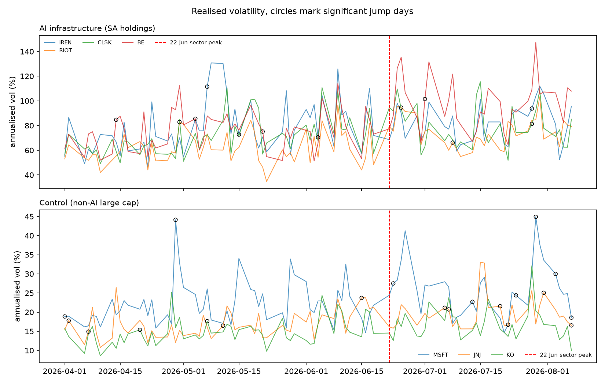
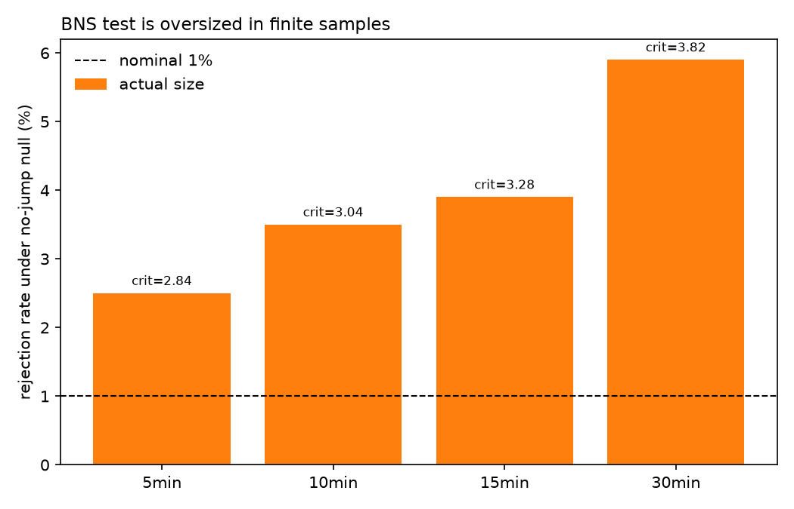
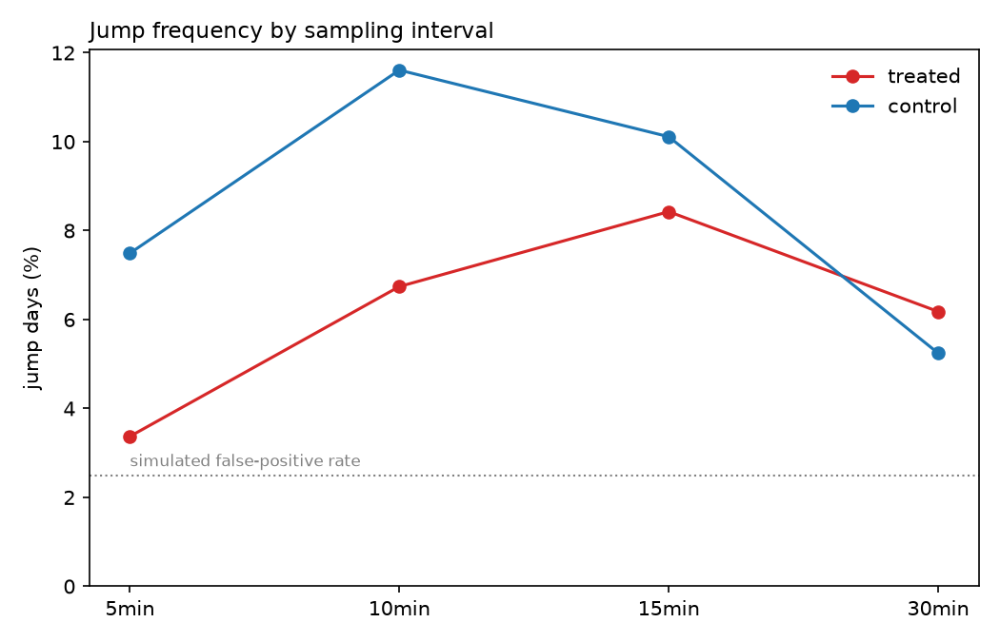

# Jump Risk in the July 2026 AI Infrastructure Drawdown

Was the July 2026 selloff in AI infrastructure equities driven by discrete
price jumps, or by sustained continuous volatility?

**Finding: it was diffusive.** The stocks that fell hardest showed roughly 11x
the realised variance of unaffected large caps, but no more jump days.

## Method

5-minute bars for 12 tickers (April-August 2026, Polygon), regular trading hours
only. For each stock-day: realised variance, bipower variation, and the
Barndorff-Nielsen and Shephard log-ratio jump test.

Groups: treated = names held by the liquidated fund; control = non-AI large caps.

## The test is oversized, and I corrected for it

Applied naively the test flagged 10-18% of stock-days as jumps at a nominal 1%
level. I calibrated it by simulating 20,000 pure-diffusion paths with no jumps.

| bars/day | nominal | actual | correct 1% critical value |
|---|---|---|---|
| 78 (5min)  | 1.0% | 2.5% | 2.84 |
| 39 (10min) | 1.0% | 3.5% | 3.04 |
| 26 (15min) | 1.0% | 3.9% | 3.28 |
| 13 (30min) | 1.0% | 5.9% | 3.82 |

All results below use the simulated critical values.

## Results

| group | 5min | 10min | 15min | 30min |
|---|---|---|---|---|
| treated | 3.4% | 6.7% | 8.4% | 6.2% |
| control | 7.5% | 11.6% | 10.1% | 5.2% |

## Limitations

- 5-minute bars are not tick data; RV is estimated with noise.
- One event. Nothing here supports inference about jump risk in general.
- Polygon free-tier data, unaudited.
- Jump rate is a ratio: high-variance names mechanically need larger moves to
  register as jumps. This design cannot separate that from a genuine difference.
- 13F holdings are lagged and incomplete, so treatment is measured with error.
